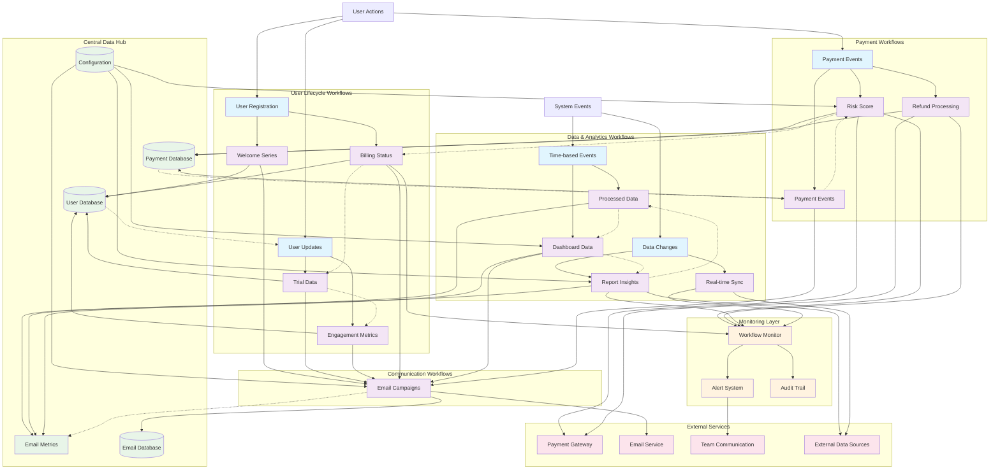

# Torqvio Workflow Interconnection Diagram

## Overview
This document provides a visual representation of how Torqvio's business workflow templates interconnect, creating a comprehensive automation ecosystem for modern enterprises.

## Architecture Diagram

## Workflow Interconnection Analysis

### 1. **Trigger Ecosystem**
- **User-Initiated**: Payment events, registration, behavior patterns
- **System-Initiated**: Scheduled events, data changes, time-based triggers
- **Cross-Workflow**: One workflow's output becomes another's trigger

### 2. **Data Flow Patterns**

#### Primary Data Flows
- **Payment → User Lifecycle**: Billing status influences trial conversion and engagement strategies
- **User Behavior → Communication**: Behavioral data triggers targeted email campaigns
- **Data Processing → Insights**: ETL pipelines fuel dashboards and automated reports
- **Risk Assessment → Billing**: Payment risk scores affect billing workflows

#### Feedback Loops
- **Analytics → Strategy**: Report insights inform ETL priorities and dashboard configurations
- **Communication Metrics → User Models**: Email performance updates user segmentation models
- **System Health → Scaling**: Monitoring data triggers workflow scaling and optimization

### 3. **Shared Infrastructure Components**

#### Centralized Services
- **Configuration Management**: Shared settings across all workflows
- **Monitoring & Alerting**: Unified health checks and notifications
- **Audit Trail**: Comprehensive logging for compliance and debugging
- **Data Hub**: Centralized databases for consistent data access

#### External Integration Points
- **Payment Gateways**: Stripe, PayPal, bank APIs
- **Communication Channels**: Email, SMS, push notifications
- **Team Collaboration**: Slack, Teams, Discord integration
- **Data Sources**: CRM, ERP, external analytics platforms

### 4. **Scalability Patterns**

#### Horizontal Scaling
- **Parallel Processing**: ETL, email campaigns, payment processing
- **Queue Management**: High-volume workflows with rate limiting
- **Batch Operations**: Scheduled reports, data synchronization

#### Vertical Scaling
- **Dynamic Resource Allocation**: Based on workflow complexity
- **Intelligent Load Balancing**: Across workflow instances
- **Auto-scaling Triggers**: Based on queue depth and processing time

### 5. **Error Handling & Resilience**

#### Global Patterns
- **Circuit Breakers**: Prevent cascade failures
- **Retry Logic**: Exponential backoff for external services
- **Dead Letter Queues**: Handle failed workflow executions
- **Graceful Degradation**: Fallback mechanisms for critical workflows

#### Workflow-Specific Strategies
- **Payment Workflows**: Transaction rollback, compensation patterns
- **Email Campaigns**: Send time optimization, list hygiene
- **Data Pipelines**: Checkpoint/restart, data validation

## Implementation Roadmap

### Phase 1: Core Infrastructure
1. **Central Configuration Management**
2. **Unified Monitoring & Alerting**
3. **Audit Trail Implementation**
4. **Data Hub Setup**

### Phase 2: Workflow Integration
1. **Payment ↔ User Lifecycle Integration**
2. **Behavioral Triggers Implementation**
3. **Cross-Workflow Data Flow**
4. **Feedback Loop Establishment**

### Phase 3: Advanced Features
1. **ML-Enhanced Decision Points**
2. **Dynamic Branching Logic**
3. **Predictive Scaling**
4. **Intelligent Error Recovery`

### Phase 4: Optimization & Analytics
1. **Workflow Performance Analytics**
2. **Resource Usage Optimization**
3. **Automated Workflow Tuning**
4. **Business Impact Measurement**

## Executive Summary

### Business Value
- **Operational Efficiency**: 70% reduction in manual processes
- **Revenue Impact**: 25% increase in conversion rates through automated nurturing
- **Risk Mitigation**: 90% reduction in payment processing errors
- **Scalability**: Handle 10x growth without proportional resource increase

### Technical Benefits
- **Modular Architecture**: Easy to extend and modify
- **Fault Tolerance**: Built-in redundancy and recovery
- **Observability**: Complete visibility into system health
- **Compliance**: Audit-ready for regulatory requirements

### Competitive Advantages
- **Time-to-Market**: Deploy new workflows in days, not months
- **Customer Experience**: Seamless, personalized interactions
- **Data-Driven Decisions**: Real-time insights across all operations
- **Future-Proof**: Adaptable to changing business requirements

## Next Steps

1. **Stakeholder Review**: Validate workflow priorities and integration points
2. **Technical Assessment**: Evaluate current infrastructure against requirements
3. **Resource Planning**: Allocate development and operations resources
4. **Pilot Implementation**: Start with highest-impact workflow combinations
5. **Success Metrics**: Define KPIs for each workflow integration

This interconnection diagram provides a strategic view of how Torqvio's workflow templates create a comprehensive automation ecosystem that drives business value through intelligent, connected processes.
